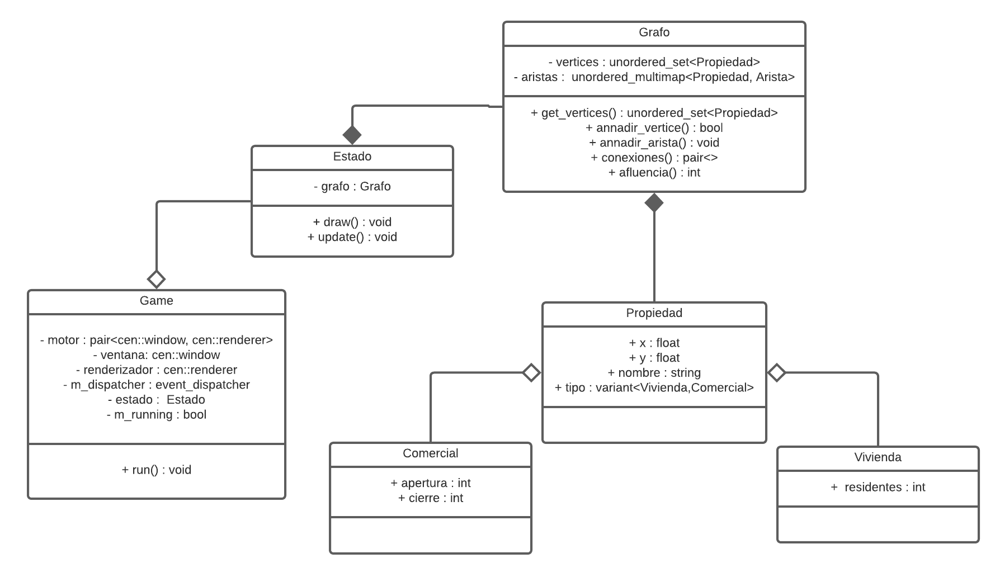

# SIMULADOR DE CONTAGIO

Simulador de contagio por zonas de afluencia soportado por grafos, metaprogramación y con visualización gráfica.

         

# REQUISITOS
- Instalar [SDL2](https://www.libsdl.org/) en alguna de las versiones y adicionales siguientes.

| Dependencia  | Versiones soportadas |
|---|---|
| SDL2   | 2.0.10, 2.0.12, 2.0.14 |
| SDL2_image (Optional)  | 2.0.5 |
| SDL2_mixer (Optional)  | 2.0.4 |
| SDL2_ttf (Optional)  | 2.0.4 |

- Adjuntar al proyecto el módulo `centurion.hpp` de [albin-johansson](https://github.com/albin-johansson/centurion)

         

# OBJETIVOS

- Simular interacción de contagio basado en la afluencia de agentes en las coordenadas de un GUI_Window.
- Aplicar conocimientos de metaprogramación, programación genérica, STL, patrones de diseño y relaciones entre clases.
- Hacer uso de una libreriá gráfica para la visualización de resultados

# DIAGRAMA UML

         

         
# BIBLIOGRAFÍA

- [Centurion](https://github.com/albin-johansson/centurion)
- [SDL2](https://www.libsdl.org/)
- [SDL2-image](https://www.libsdl.org/projects/SDL_image/)
- [Manjaro Linux](https://manjaro.org/)
