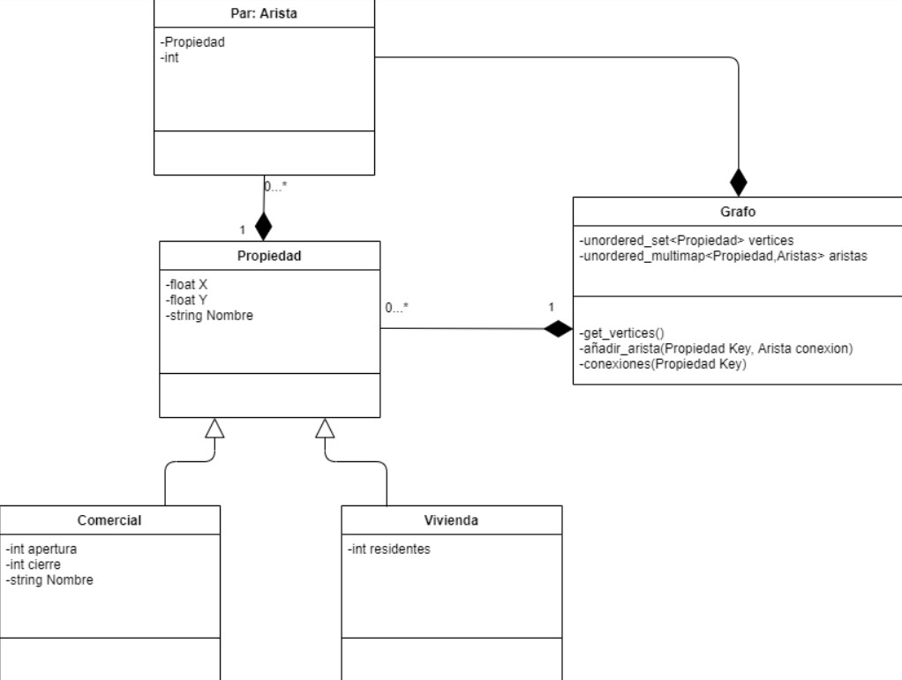

# SIMULADOR CONTAGIO

Simulador de contagio de una ciudad con diferentes áreas (centro comercial, vivienda,etc)

# REQUISITOS
- Instalar [SDL](https://www.libsdl.org/)
- Adjuntar al proyecto el módulo `centurion.hpp` de [albin-johansson](https://github.com/albin-johansson/centurion)

         

# OBJETIVOS

# RESUMEN DEL PROGRAMA

- singleton
- abstract factory
- adapter 
- composite

# DIAGRAMA UML

         

         
         
# BIBLIOGRAFÍA

